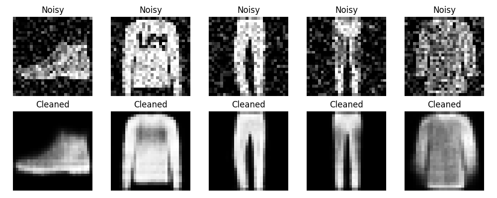

# Image Denoising Autoencoder

A deep learning project built with TensorFlow that removes noise from images using an Autoencoder neural network. The model is trained to reconstruct clean Fashion MNIST images from noisy inputs.

*Top row: Noisy input images. Bottom row: Images reconstructed by the Autoencoder.*

## What It Does

* Loads the Fashion MNIST dataset
* Adds random noise to images
* Trains an Autoencoder neural network to remove the noise
* Reconstructs cleaner versions of the images
* Visualizes the original noisy images alongside the reconstructed outputs

## Technologies Used

* Python
* TensorFlow / Keras
* NumPy
* Matplotlib

## Results

The trained Autoencoder was able to reduce noise and recover the main features of clothing images from the Fashion MNIST dataset. The reconstructed images are noticeably cleaner while preserving the important details of the original items.

## What I Learned

* Building and training neural networks with TensorFlow
* Understanding how Autoencoders work for image reconstruction
* Preprocessing image data for machine learning
* Applying noise augmentation techniques
* Evaluating and visualizing deep learning model outputs
* Working with computer vision datasets
